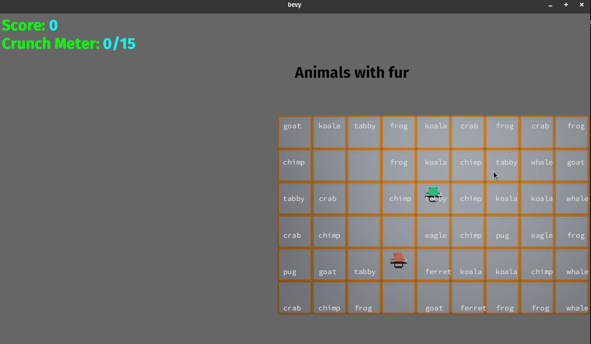

# rust-cruncher-munchers
A basic Rust tribute of MECC's Munchers learning game

# []

## Description
Using Bevy, a game engine for Rust engineers, I developed a Super Munchers clone with some of the basic features and utilized 3d models to slightly modernize the appearance of the typical Munchers style. See an [online archive version of Super Munchers here](https://archive.org/details/msdos_Super_Munchers_-_The_Challenge_Continues..._1991).

## Version
See [Cargo.toml](Cargo.toml) version

## Platforms / Technologies
* [Rust](https://www.rust-lang.org/en-US/)
* [Cargo](https://doc.rust-lang.org/cargo/)
* [Bevy](https://bevyengine.org/)

## Run
>      $ cargo run

## Build For Release
>      $ cargo build --release